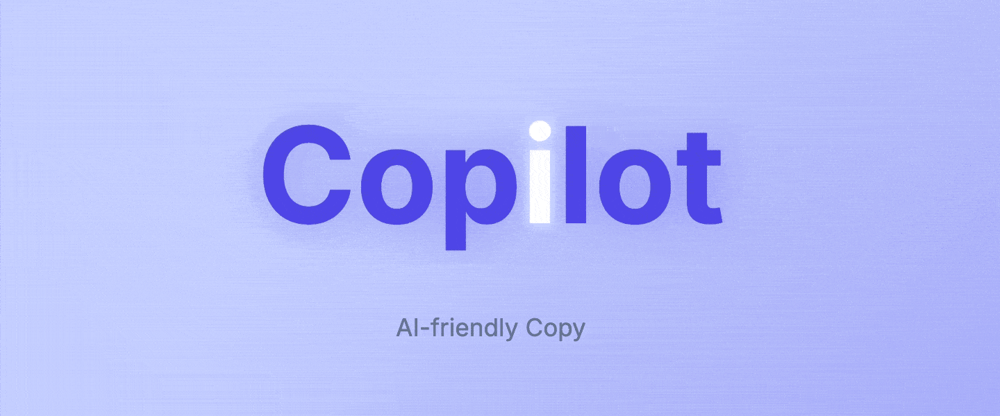
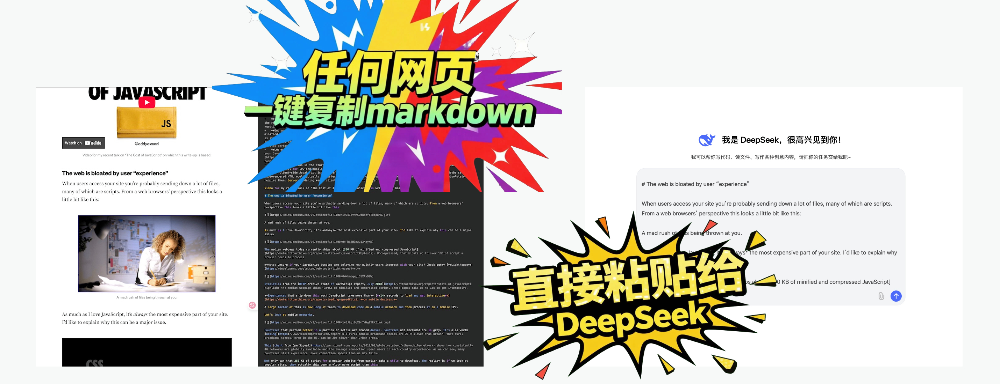
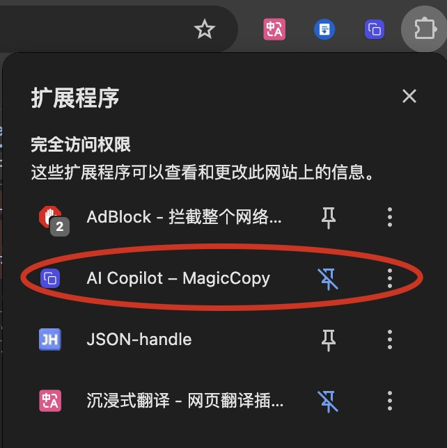
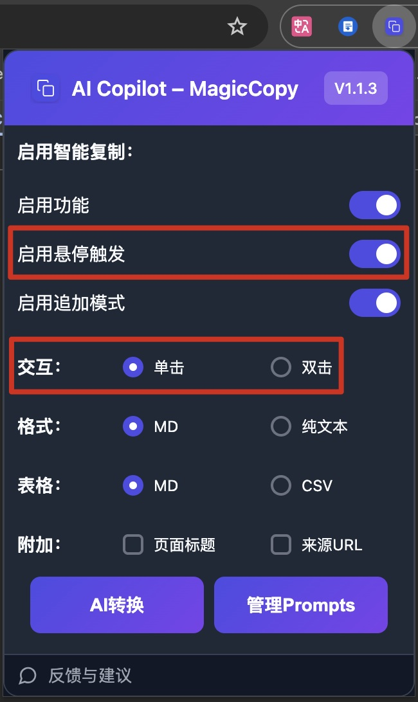
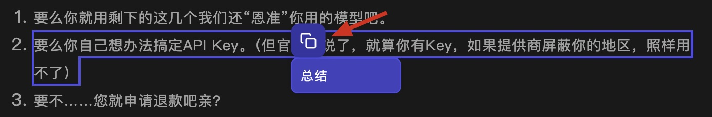
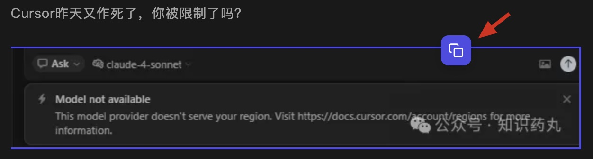
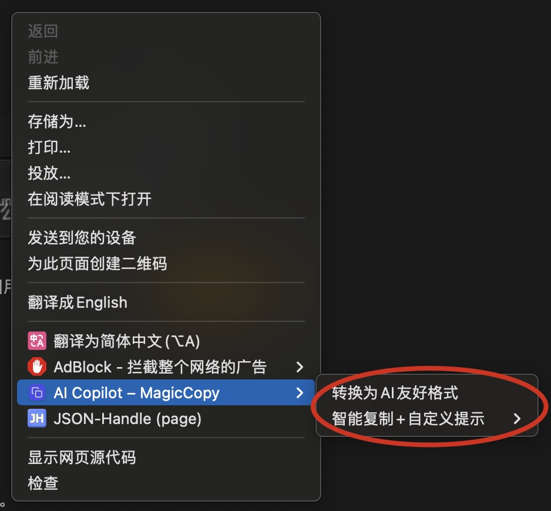
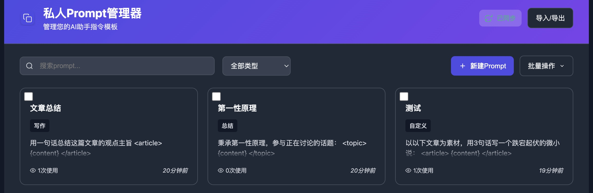
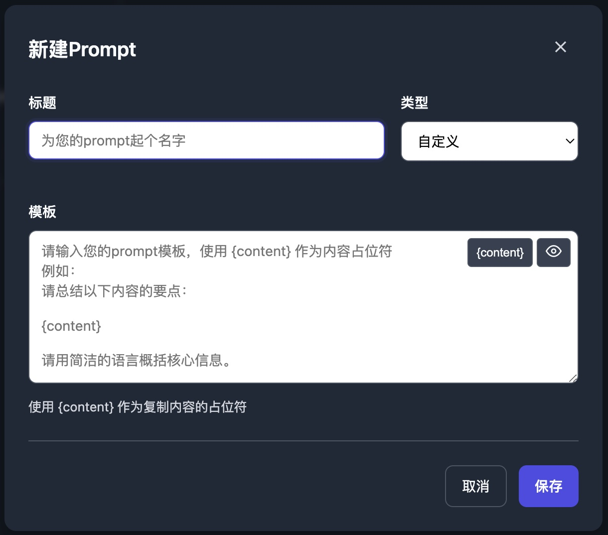
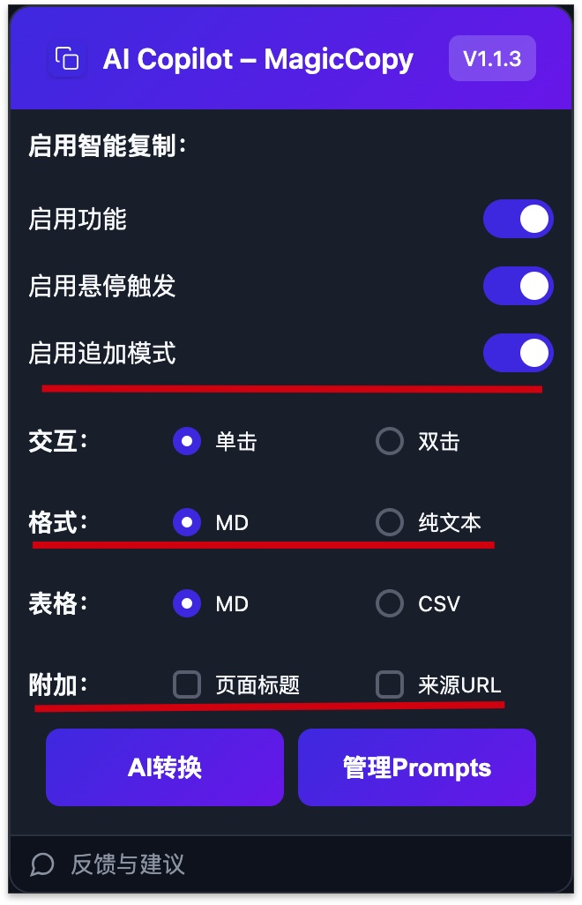

# Copylot

一款浏览器插件，旨在帮助您轻松、智能地复制网页内容，并将其转换为对AI友好的格式，极大地提升您与AI助手协作的效率。

## 功能介绍

Copylot 是一款旨在解决您在浏览网页、收集资料时“复制粘贴”痛点的浏览器插件。它不是简单的复制，而是智能地提取、清理和格式化网页内容，使其完美适配您与 AI 助手（如 ChatGPT、Kimi）的协作或本地笔记（如 Obsidian、Notion）的整理需求。

我们的核心目标是：**让您从网页上复制的任何内容，无需二次整理，即可直接使用。**

---

### ⭐ 核心功能亮点

1.  **【智能识别与提取】—— 告别无关信息**
    -   **场景：** 当您想复制一篇博客文章或新闻报道时，常常会不小心带上导航栏、广告、推荐阅读等多余内容。
    -   **Copylot 解决方案：** 只需在文章主体上轻轻一点，Copylot 会自动识别核心内容区域，并生成一份干净、整洁、排除所有干扰的 Markdown 文本。

2.  **【追加复制模式 (Append Mode)】—— 跨页面信息整合利器**
    -   **场景：** 您正在为一份报告或论文查阅资料，需要在多个不同的网页、甚至同一页面的不同段落中摘取信息。传统的“复制-切换窗口-粘贴”操作流繁琐且低效。
    -   **Copylot 解决方案：**
        -   在需要追加复制时，**按住 `Shift` 键再点击复制**。
        -   Copylot 会将新复制的内容自动追加到剪贴板中，并用美观的分隔符 `---` 隔开。
        -   插件图标上会显示一个角标，实时告诉您已经合并了多少条内容。
        -   所有资料收集完毕后，一次性粘贴即可，所有内容井井有条。

3.  **【网页表格一键转换 (CSV & Markdown)】—— 数据工作者的福音**
    -   **场景：** 从网页上复制表格数据是一场灾难。格式混乱、对不齐，无法直接粘贴到 Excel、Google Sheets 或数据库中。
    -   **Copylot 解决方案：**
        -   当您点击网页上的任意表格时，Copylot 会将其完整识别。
        -   您可以选择将表格一键转换为 **CSV** 格式，完美导入各类数据分析工具。
        -   您也可以选择将其转换为 **Markdown** 格式，轻松粘贴到 Notion、GitHub 或其他支持 Markdown 的文档平台，保持清晰的表格结构。

4.  **【代码块专业级清理】—— 开发者必备**
    -   **场景：** 从技术博客或论坛（如 Stack Overflow）复制代码时，常常会带上行号、`$` 或 `>` 等命令行提示符，甚至还有“复制”按钮的文本，这些“杂质”使得代码无法直接运行。
    -   **Copylot 解决方案：** 它能精准识别代码块 (`<pre>`/`<code>`)，并在复制时自动执行以下清理，得到纯净代码：
        -   **自动移除**行尾的 “Copy”、“复制代码” 等多余文本。
        -   **智能反转义**网页上被错误处理的特殊字符，确保代码的准确性。
        -   **完整保留**原始的缩进和格式，代码结构不被破坏。

5.  **【私人 Prompt 管理器】—— 打造您的专属 AI 工作流**
    -   **场景：** 您经常需要让 AI 对复制的内容执行相同的操作，例如“翻译成英文”、“总结这段话”、“为这段代码写注释”等，每次都要手动输入一遍指令，非常重复。
    -   **Copylot 解决方案：**
        -   内置强大的 **Prompt 管理器**，您可以将这些常用指令创建为模板（例如：“请将以下内容翻译成英文：\n\n{content}”）。`{content}` 是一个占位符，代表您复制的内容。
        -   在网页上选中文字，通过右键菜单或悬浮按钮，选择您预设好的 Prompt。
        -   Copylot 会自动将 **“您的指令” + “您复制的内容”** 合并成一段完整的文本复制到剪贴板。您只需粘贴给 AI，即可获得结果。
        -   所有 Prompt **通过浏览器账户云端同步**，您在任何一台电脑上配置的 Prompt 都会自动同步，无需重复设置。

### ▶️ 基础功能

-   **多种交互模式：** 支持**单击**、**双击**或**悬停**触发复制，可在设置中自由切换。
-   **格式选择：** 支持输出为 **Markdown** 或 **纯文本**。
-   **附加来源信息：** 可选在复制内容末尾自动附上页面的**标题和URL**，方便溯源。

## 如何使用

### 1. 安装与启用

从Chrome网上应用店或其他官方渠道安装插件后，Copylot默认启用。您可以在浏览器的插件管理页面随时禁用或启用它。

### 2. 基本复制操作

- **选择复制模式**：点击浏览器工具栏上的Copylot图标，在弹出的菜单中可以设置交互模式（单击/双击）和是否启用悬停触发。

- **执行复制**：
    - **单击/双击**：在网页上找到您想复制的内容区域，单击或双击（取决于您的设置），内容块会被高亮显示，此时已成功复制到剪贴板。

    - **悬停**：将鼠标移动到内容块上，旁边会出现Copylot的图标，点击它即可复制。

### 3. 使用右键菜单

在页面任意位置点击右键，您会看到Copylot相关的选项：

- **转换为AI友好格式**：将整个页面的主要内容复制为Markdown。
- **智能复制+自定义提示**：这会弹出一个包含您预设Prompt的菜单。选择一个Prompt，Copylot会将当前选中的文本（或整个页面内容，如果未选择文本）与Prompt结合后复制到剪贴板。

### 4. 管理您的Prompt

1. 右键点击浏览器工具栏上的Copylot图标，选择“选项”。
2. 在打开的“Prompt管理器”页面，您可以：
    - **新建Prompt**：点击“新建Prompt”，为您的常用操作创建模板，例如“总结以下内容：{content}”、“将{content}翻译成英文”等。`{content}`是您复制内容的占位符。
    - **管理**：对现有的Prompt进行搜索、编辑、删除和分类。
    - **导入/导出**：方便地备份和分享您的Prompt库。

### 5. 设置

点击浏览器工具栏上的Copylot图标，可以进行一些常用设置：

- **输出格式**：选择Markdown或纯文本。
- **附加信息**：选择是否在复制内容中包含页面标题和URL。
- **追加模式**：临时启用或禁用追加复制功能。

---

希望这份指南能帮助您更好地使用AI Copilot – Copylot，让您的网页信息处理和AI协作流程更加顺畅高效！如果您有任何问题或建议，欢迎通过插件设置页面中的“反馈与建议”链接与我们联系。 