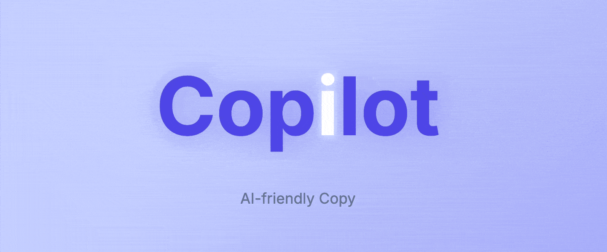
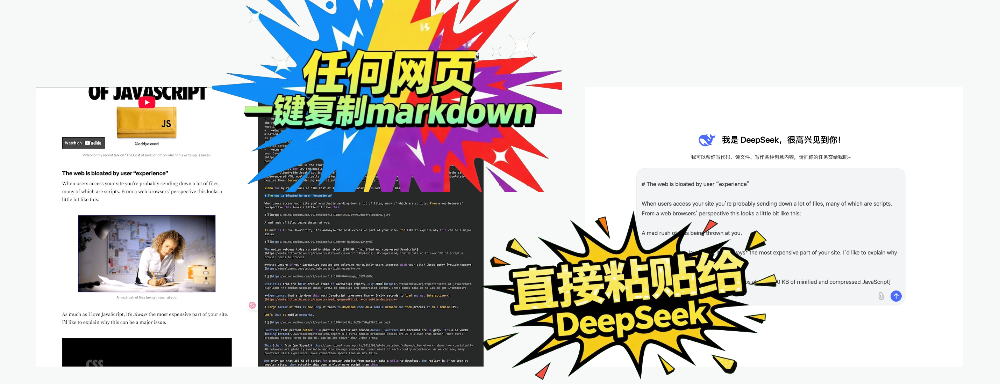
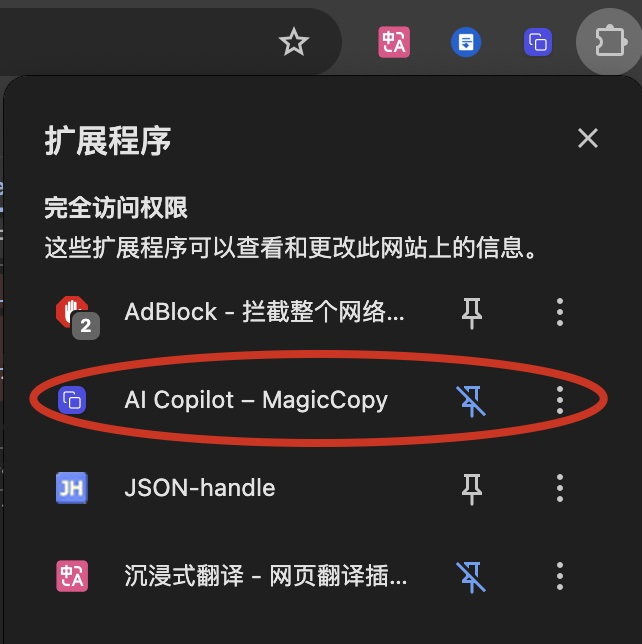
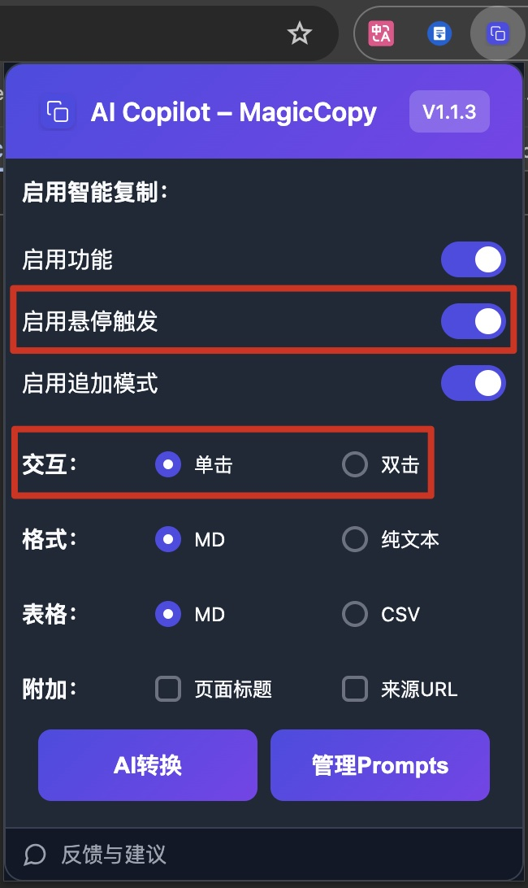
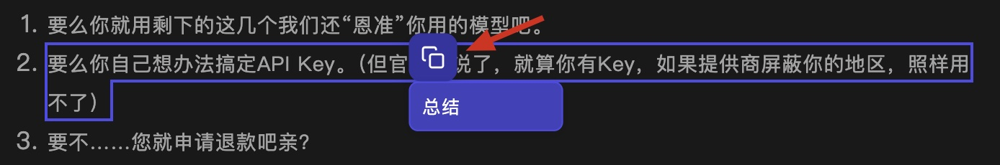
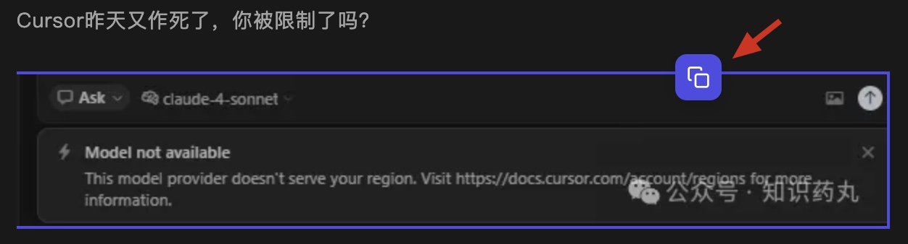
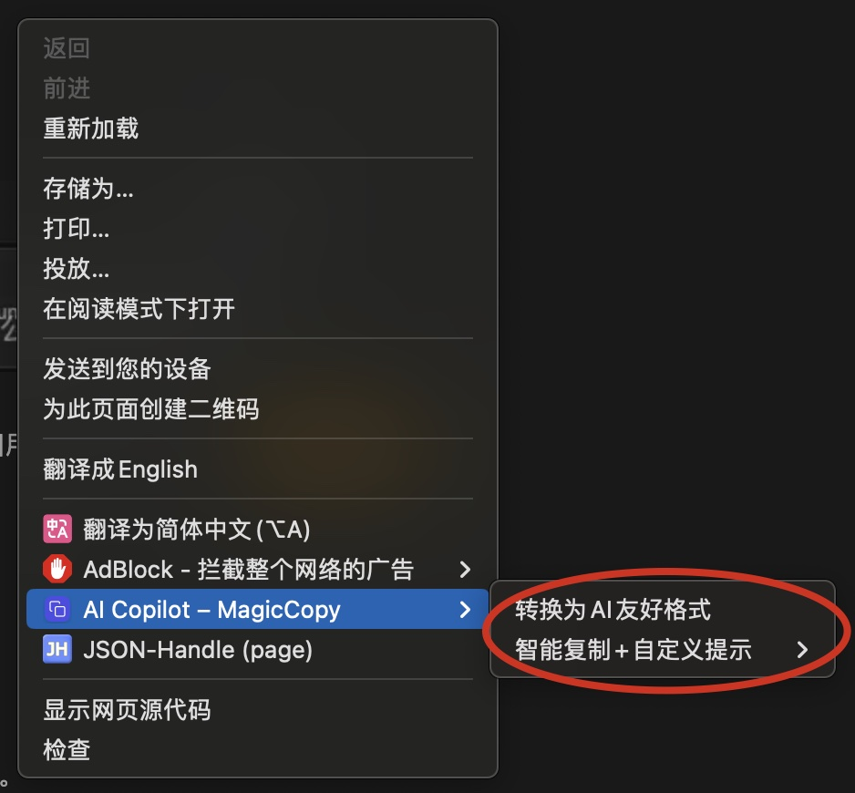
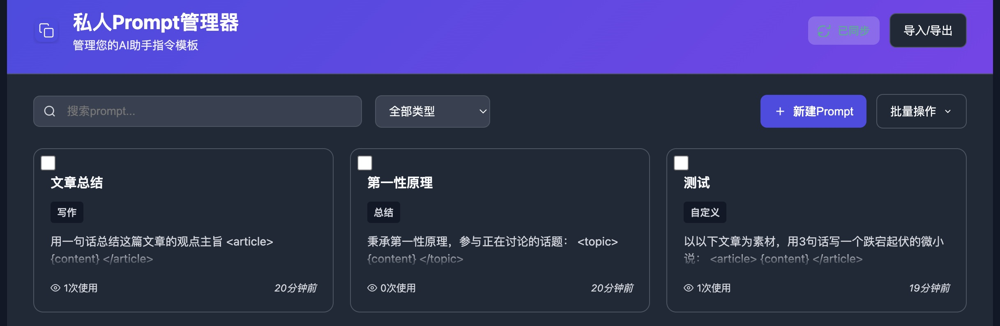
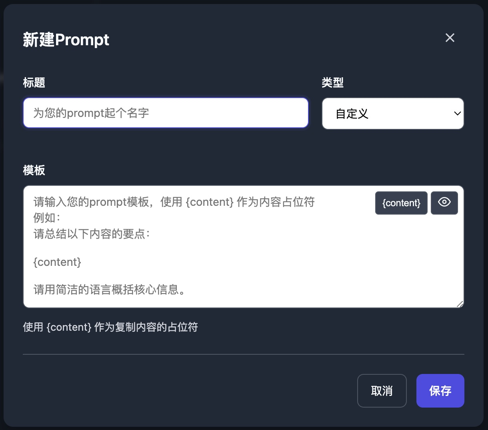
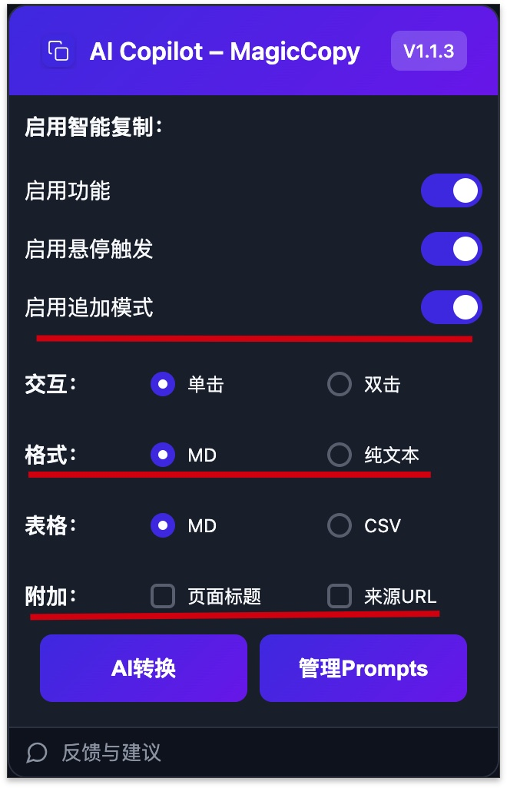

# Copylot

一款浏览器插件，旨在帮助您轻松、智能地复制网页内容，并快速整理后交给 AI，极大地提升您与AI助手协作的效率。

## 功能介绍

Copylot 是一款旨在解决您在浏览网页、收集资料时“复制粘贴”痛点的浏览器插件。它不是简单的复制，而是智能地提取、清理和格式化网页内容，使其完美适配您与 AI 助手（如 ChatGPT、Kimi）的协作或本地笔记（如 Obsidian、Notion）的整理需求。

我们的核心目标是：**尽量减少您从网页复制内容后的二次整理成本，让大多数常见场景可以直接使用。**

---

### ⭐ 核心功能亮点

1.  **【智能识别与提取】—— 告别无关信息**
    -   **场景：** 当您想复制一篇博客文章或新闻报道时，常常会不小心带上导航栏、广告、推荐阅读等多余内容。
    -   **Copylot 解决方案：** 只需在文章主体上轻轻一点，Copylot 会优先按 `main/article` 等语义结构定位正文，在整页路径下再用内容密度做兜底，并保守剔除常见 `nav/aside/footer/related/share` 噪音，生成更适合 AI 使用的 Markdown 文本。对于结构复杂或正文边界不清晰的页面，仍可能需要手动选区以获得最佳结果。

2.  **【追加复制模式 (Append Mode)】—— 跨页面信息整合利器**
    -   **场景：** 您正在为一份报告或论文查阅资料，需要在多个不同的网页、甚至同一页面的不同段落中摘取信息。传统的“复制-切换窗口-粘贴”操作流繁琐且低效。
    -   **Copylot 解决方案：**
        -   在需要追加复制时，**按住 `Shift` 键再点击复制**。
        -   Copylot 会将新复制的内容自动追加到剪贴板中，并用美观的分隔符 `---` 隔开。
        -   插件图标上会显示一个角标，实时告诉您已经合并了多少条内容。
        -   所有资料收集完毕后，一次性粘贴即可，所有内容井井有条。

3.  **【网页表格一键转换 (CSV & Markdown)】—— 数据工作者的福音**
    -   **场景：** 从网页上复制表格数据是一场灾难。格式混乱、对不齐，无法直接粘贴到 Excel、Google Sheets 或数据库中。
    -   **Copylot 解决方案：**
        -   当您点击网页上的任意表格时，Copylot 会将其完整识别。
        -   您可以选择将表格一键转换为 **CSV** 格式，完美导入各类数据分析工具。
        -   您也可以选择将其转换为 **Markdown** 格式，轻松粘贴到 Notion、GitHub 或其他支持 Markdown 的文档平台，保持清晰的表格结构。
        -   对于**不规范表格**（例如没有 thead/首行不是 th、role="presentation" 的表），Copylot 也会自动生成**占位表头**（使用“—”）并按 GFM 规范输出 Markdown 表格；若表格包含跨行/跨列，会自动展开为规则矩阵并填充单元格内容，尽可能还原视觉结果。
        -   如果单元格内包含多行文本与特殊字符（如“|”），会自动进行转义（换行渲染为“ ”），确保 Markdown 表格不会破坏。
        -   嵌套表格先行内化为紧凑文本再参与生成。
        -   教程链接：[网页表格一键转 CSV / Markdown（3 分钟上手）](docs/tutorials/table-to-csv-markdown.md)

4.  **【代码块专业级清理】—— 开发者必备**
    -   **场景：** 从技术博客或文档页复制代码时，常常会带上行号、被渲染进代码文本的“Copy/复制代码”按钮文案，或出现少量被转义的符号（例如 `\\#`），这些“杂质”会导致你需要二次整理。
    -   **Copylot 解决方案：** 它能识别代码块（`<pre>`/`<code>`），并在复制时做**保守、可审计**的清理，尽量得到“可直接运行/可直接发给 AI”的干净代码：
        -   **保守去噪：** 若“Copy/复制代码”等按钮文案被渲染进代码文本，仅移除**首/末端整行**的同类文案（避免误删真实代码）。
        -   **行号处理（有边界）：** 仅在代码块 DOM 结构可识别为“行号/代码分列”时去除行号，不承诺覆盖所有站点。
        -   **少量反转义：** 对少量 Markdown 转义字符做保守反转义（如 `\\#`、`\\[`、`\\]`）。
        -   **保留缩进与空行：** 完整保留内部缩进/空行，仅裁剪首尾空行。
        -   教程链接：[代码块专业级清理：保留缩进 / 去噪 / 避免误删（3 分钟上手）](docs/tutorials/code-block-cleaning.md)

5.  **【私人 Prompt 管理器】—— 打造您的专属 AI 工作流**
    -   **场景：** 您经常需要让 AI 对复制的内容执行相同的操作，例如“翻译成英文”、“总结这段话”、“为这段代码写注释”等，每次都要手动输入一遍指令，非常重复。
    -   **Copylot 解决方案：**
        -   内置强大的 **Prompt 管理器**，您可以将这些常用指令创建为模板（例如：“请将以下内容翻译成英文：\n\n{content}”）。`{content}` 是一个占位符，代表您复制的内容。
        -   在网页上选中文字，通过右键菜单、悬浮按钮，或直接使用 **快捷键 / Popup 快捷按钮**，选择您预设好的 Prompt。
        -   Copylot 会自动将 **“您的指令” + “您复制的内容”** 合并成一段完整的文本复制到剪贴板。您只需粘贴给 AI，即可获得结果。
        -   可将 3 个最常用 Prompt 绑定为 **快捷 Prompt 1 / 2 / 3**，默认快捷键为：
            - Windows / Linux：`Alt + 1 / 2 / 3`
            - macOS：`Option + 1 / 2 / 3`
        -   默认的 **复制给AI（Copy to AI）** 使用：
            - Windows / Linux：`Alt + C`
            - macOS：`Option + C`
        -   如需改键，请在插件面板中点击“打开快捷键设置”，跳转到 `chrome://extensions/shortcuts`
        -   所有 Prompt **通过浏览器账户云端同步**，您在任何一台电脑上配置的 Prompt 都会自动同步，无需重复设置。
        -   教程链接：[Prompt 工作流：复制内容 → 套用 Prompt → 一键发给 AI（3 分钟上手）](docs/tutorials/prompt-workflow.md)

### ▶️ 基础功能

-   **多种交互模式：** 支持**单击**、**双击**或**悬停**触发复制，可在设置中自由切换。
-   **格式选择：** 支持输出为 **Markdown** 或 **纯文本**。
-   **附加来源信息：** 可选在复制内容末尾自动附上页面的**标题和URL**，方便溯源。

## 如何使用

### 1. 安装与启用

从Chrome网上应用店或其他官方渠道安装插件后，Copylot默认启用。您可以在浏览器的插件管理页面随时禁用或启用它。

### 2. 基本复制操作

- **选择复制模式**：点击浏览器工具栏上的Copylot图标，在弹出的菜单中可以设置交互模式（单击/双击）和是否启用悬停触发。

- **执行复制**：
    - **单击/双击**：在网页上找到您想复制的内容区域，单击或双击（取决于您的设置），内容块会被高亮显示，此时已成功复制到剪贴板。

    - **悬停**：将鼠标移动到内容块上，旁边会出现Copylot的图标，点击它即可复制。

### 3. 使用右键菜单

在页面任意位置点击右键，您会看到Copylot相关的选项：

- **复制给AI**：将整个页面的主要内容复制为 Markdown，优先适合直接粘贴给 AI。
- **Prompt 列表**：在 Chrome 中通常显示为 `Copylot > 某个 Prompt`。选择任一 Prompt 后，Copylot 会将当前选中的文本（若未选中，则回退到整页主要内容）与 Prompt 结合后复制到剪贴板。

如果你希望走最短路径，推荐直接使用：

- **快捷键**
  - 复制给AI：Windows / Linux `Alt + C`，macOS `Option + C`
  - 快捷 Prompt 1 / 2 / 3：Windows / Linux `Alt + 1 / 2 / 3`，macOS `Option + 1 / 2 / 3`
- **Popup 顶部快捷按钮**
  - 打开工具栏中的 Copylot，即可直接看到“复制给AI”和 3 个快捷 Prompt 按钮
  - Popup 与 Options 页都提供“打开快捷键设置”按钮，可直接前往 Chrome 官方快捷键页面修改绑定

### 4. 管理您的Prompt

1. 右键点击浏览器工具栏上的Copylot图标，选择“选项”。
2. 在打开的“Prompt管理器”页面，您可以：
    - **新建Prompt**：点击“新建Prompt”，为您的常用操作创建模板，例如“总结以下内容：{content}”、“将{content}翻译成英文”等。`{content}`是您复制内容的占位符。
    - **绑定快捷位**：可为高频 Prompt 绑定“快捷 Prompt 1 / 2 / 3”，这样就能从快捷键和 Popup 顶部按钮直接触发。
    - **管理**：对现有的Prompt进行搜索、编辑、删除和分类。
    - **导入/导出**：方便地备份和分享您的Prompt库。

### 5. 设置

点击浏览器工具栏上的Copylot图标，可以进行一些常用设置：

- **快捷操作区**：直接执行“复制给AI”和 3 个快捷 Prompt。
- **快捷键设置区**：显示当前绑定 / 推荐绑定，并一键打开 Chrome 官方快捷键设置页。
- **输出格式**：选择Markdown或纯文本。
- **附加信息**：选择是否在复制内容中包含页面标题和URL。
- **追加模式**：临时启用或禁用追加复制功能。
- **更多设置折叠区**：除“启用智能复制”外，其他设置默认收起，减少高频操作时的视觉干扰。

---

希望这份指南能帮助您更好地使用AI Copilot – Copylot，让您的网页信息处理和AI协作流程更加顺畅高效！如果您有任何问题或建议，欢迎通过插件设置页面中的“反馈与建议”链接与我们联系。 
